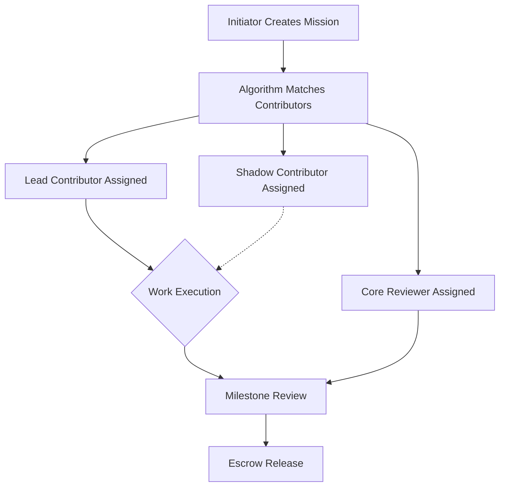
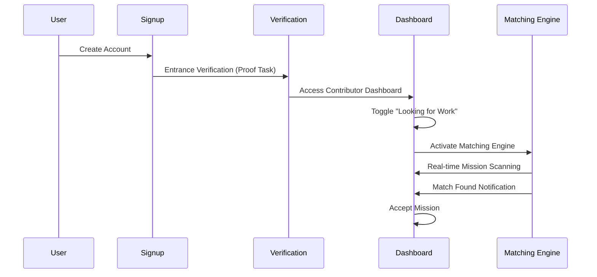
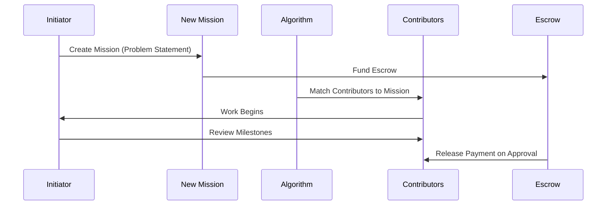

# PEOPLE Platform - Complete Application Documentation

> **Last Updated:** January 1, 2026  
> **Version:** Alpha/MVP

---

## 📋 Table of Contents

1. [Application Overview](#application-overview)
2. [Core Concept & Value Proposition](#core-concept--value-proposition)
3. [Application Workflow](#application-workflow)
4. [Technology Stack](#technology-stack)
5. [File Structure & Documentation](#file-structure--documentation)
6. [Pages Documentation](#pages-documentation)
7. [Components Documentation](#components-documentation)
8. [State Management](#state-management)
9. [Backend Documentation](#backend-documentation)
10. [Feature Completion Status](#feature-completion-status)
11. [What's Left To Build](#whats-left-to-build)

---

## Application Overview

**PEOPLE** is a curated mission-based collaboration platform that connects **Initiators** (clients who need work done) with **Contributors** (top-tier student builders who execute the work). Unlike traditional freelancing platforms, PEOPLE operates on a "Mission Model" where work begins with a problem, not a person.

### Key Differentiators

| Feature | PEOPLE Approach | Traditional Freelancing |
|---------|----------------|------------------------|
| **Hiring Model** | Algorithmic matching | Bidding wars |
| **Quality Assurance** | Shadow contributors + Core reviewers | Single freelancer |
| **Payment** | Milestone-based escrow | Upfront or hourly |
| **Profiles** | Hidden, merit-based | Public, popularity-driven |
| **Network Entry** | Reasoning-based proof tasks | Resume screening |

---

## Core Concept & Value Proposition

### The Mission Model



### User Roles

1. **Initiators** - Clients who:
   - Submit missions/problems to be solved
   - Fund escrow accounts
   - Review and approve milestone deliverables
   - Don't need to hunt for freelancers

2. **Contributors** - Builders who:
   - Pass reasoning-based entrance verification
   - Get algorithmically matched to missions
   - Earn through milestone completion
   - Build merit through internal work graphs

### Zero-Failure System

Every mission includes:
- **Lead Contributor**: Primary executor
- **Shadow Contributor**: Backup who can step in instantly
- **Core Reviewer**: Quality assurance and review

---

## Application Workflow

### User Journey - Contributor



### User Journey - Initiator



---

## Technology Stack

### Frontend (Client)

| Technology | Version | Purpose |
|------------|---------|---------|
| React | 19.2.0 | UI Framework |
| Vite | 7.2.4 | Build Tool & Dev Server |
| React Router DOM | 7.11.0 | Client-side Routing |
| Zustand | 5.0.9 | State Management |
| Tailwind CSS | 3.4.1 | Styling |
| Framer Motion | 12.23.26 | Animations |
| Lucide React | 0.562.0 | Icon Library |
| Sonner | 2.0.7 | Toast Notifications |
| clsx + tailwind-merge | Latest | Class Utilities |

### Backend (Server)

| Technology | Version | Purpose |
|------------|---------|---------|
| Express | 5.2.1 | HTTP Server |
| CORS | 2.8.5 | Cross-Origin Support |
| dotenv | 17.2.3 | Environment Variables |

### Design System

- **Typography**: Stack Sans Notch (Primary), JetBrains Mono (Code)
- **Color Palette**: Deep black (#000), Card backgrounds (#0A0A0A), Accent whites
- **Border Style**: Subtle white/10% borders
- **UI Philosophy**: "Workway" aesthetic - data density, dark theme, sharp edges

---

## File Structure & Documentation

```
people/
├── client/                         # Frontend Application
│   ├── public/
│   │   └── fonts/                  # Custom fonts
│   │       ├── stack-sans-notch/   # Primary display font
│   │       └── jetbrains-mono/     # Monospace font
│   ├── src/
│   │   ├── App.jsx                 # Main router & app shell
│   │   ├── main.jsx                # React entry point
│   │   ├── index.css               # Global styles & Tailwind
│   │   ├── assets/                 # Static assets
│   │   ├── components/             # Reusable UI components
│   │   │   ├── auth/               # Authentication forms
│   │   │   ├── dashboard/          # Dashboard-specific components
│   │   │   ├── layout/             # Layout components (Navbar, Footer)
│   │   │   ├── notifications/      # Notification system
│   │   │   └── ui/                 # Base UI primitives
│   │   ├── lib/                    # Utility functions
│   │   ├── pages/                  # Route pages
│   │   │   ├── applications/       # Application/verification flows
│   │   │   ├── dashboard/          # Dashboard views
│   │   │   └── missions/           # Mission-related pages
│   │   └── store/                  # Zustand state stores
│   ├── tailwind.config.js          # Tailwind configuration
│   ├── vite.config.js              # Vite configuration
│   └── package.json                # Dependencies
│
└── server/                         # Backend Application
    ├── index.js                    # Express server entry
    └── package.json                # Server dependencies
```

---

## Pages Documentation

### Public Pages

#### `/` - Landing Page
**File:** `src/pages/LandingPage.jsx`

| Aspect | Details |
|--------|---------|
| **Purpose** | Marketing landing page showcasing the platform |
| **Sections** | Hero, Features Grid (6 cards), CTA |
| **Key Features** | Terminal-style visual, "Missions Not Gigs" messaging |
| **Status** | ✅ Complete (UI) |

**Key Elements:**
- Dynamic terminal visual simulating mission initialization
- 6-feature grid explaining platform differentiators
- Dual CTAs: "Start a Mission" (Initiator) & "Join the Network" (Contributor)

---

#### `/explore` - Mission Explore Page
**File:** `src/pages/missions/MissionExplorePage.jsx`

| Aspect | Details |
|--------|---------|
| **Purpose** | Browse available missions in the marketplace |
| **Data** | Currently uses mock `MISSIONS` array |
| **Cards Display** | Title, bounty, type, complexity, team slots, tags |
| **Status** | ✅ Complete (UI), ❌ No API integration |

**Mission Types Supported:**
- Algorithm, Frontend, Backend, QA, Security, Design

---

#### `/missions/:id` - Mission Details Page
**File:** `src/pages/missions/MissionDetailsPage.jsx`

| Aspect | Details |
|--------|---------|
| **Purpose** | Detailed view of a single mission |
| **Sections** | Header, About, Requirements, Performance Targets, Bounty Breakdown, Creator Info |
| **Status** | ✅ Complete (UI), ❌ Static data (ignores :id param) |

---

#### `/network` - Network Page
**File:** `src/pages/NetworkPage.jsx`

| Aspect | Details |
|--------|---------|
| **Purpose** | Display curated network of peer contributors |
| **Data** | Mock `PEERS` array with trust scores & match percentages |
| **Features** | Peer cards with status, stack, trust/match scores |
| **Status** | ✅ Complete (UI), ❌ No real data |

---

#### `/integrations` - Integrations Page
**File:** `src/pages/IntegrationsPage.jsx`

| Aspect | Details |
|--------|---------|
| **Purpose** | Showcase platform integrations |
| **Integrations Listed** | GitHub, Slack, Figma, Supabase, Stripe, Vercel |
| **Status** | ✅ Complete (UI), ❌ No actual integration logic |

---

#### `/contact` - Contact Page
**File:** `src/pages/ContactPage.jsx`

| Aspect | Details |
|--------|---------|
| **Purpose** | Support contact form |
| **Features** | Topic dropdown, message textarea, success state |
| **Status** | ✅ Complete (UI), ❌ No email/API submission |

---

### Auth Pages

#### `/login` & `/signup` - Authentication Page
**File:** `src/pages/AuthPage.jsx`

| Aspect | Details |
|--------|---------|
| **Purpose** | User authentication (login/signup toggle) |
| **Mode Detection** | URL param `?mode=signup` for initial state |
| **Subcomponents** | `LoginForm`, `SignupForm` |
| **Status** | ✅ Complete (UI), ❌ Mock authentication only |

---

### Dashboard Pages

#### `/dashboard/contributor` - Contributor Dashboard
**File:** `src/pages/dashboard/ContributorDashboard.jsx`

| Aspect | Details |
|--------|---------|
| **Purpose** | Central hub for contributors |
| **Key Features** | Work status toggle, Matching Engine visual, Match Power meter |
| **States** | "Incognito" (not looking) vs "Looking for Work" |
| **Status** | ✅ Complete (UI), ❌ Mock data, no backend |

**Components:**
- Toggle switch with toast feedback
- Timeline visualization of matching stages
- Match Power progress bar with verification checklist

---

#### `/dashboard/initiator` - Initiator Dashboard
**File:** `src/pages/dashboard/InitiatorDashboard.jsx`

| Aspect | Details |
|--------|---------|
| **Purpose** | Mission control for initiators |
| **Sections** | Stats overview, Active missions list |
| **Stats Cards** | Total Escrowed, Active Contributors, Action Items |
| **Status** | ✅ Complete (UI), ❌ Mock data |

---

#### `/missions/new` - New Mission Page
**File:** `src/pages/missions/NewMissionPage.jsx`

| Aspect | Details |
|--------|---------|
| **Purpose** | Form for initiators to create new missions |
| **Fields** | Title, Problem Statement, Success Criteria, Budget Range, Timeline |
| **Status** | ✅ Complete (UI), ❌ No form submission logic |

---

#### `/apply` - Contributor Application
**File:** `src/pages/applications/ContributorApplication.jsx`

| Aspect | Details |
|--------|---------|
| **Purpose** | Entrance verification for new contributors |
| **Format** | Timed proof task with coding scenario |
| **Example Task** | "The Race Condition" - architectural analysis |
| **Status** | ✅ Complete (UI), ❌ No actual grading system |

---

## Components Documentation

### Layout Components

#### Navbar
**File:** `src/components/layout/Navbar.jsx`

| Feature | Description |
|---------|-------------|
| **Position** | Fixed top, z-50 |
| **Logo** | Links to home |
| **Nav Links** | Missions, Network, Integrations |
| **Dashboard Mode** | Shows role switcher (Contributor/Initiator) |
| **Actions** | NotificationCenter, Dashboard/Signup buttons |

---

#### Footer
**File:** `src/components/layout/Footer.jsx`

| Feature | Description |
|---------|-------------|
| **Sections** | Product, Developers, Company, Legal |
| **Links** | Mostly placeholder (#) links |
| **Branding** | "Built with Cloudflare Workers & Pages" |

---

#### DashboardLayout
**File:** `src/components/layout/DashboardLayout.jsx`

| Feature | Description |
|---------|-------------|
| **Purpose** | Wrapper for all dashboard pages |
| **Composition** | Navbar + children + Footer |
| **Styling** | `max-w-7xl` container, proper padding |

---

### UI Components

#### Button
**File:** `src/components/ui/Button.jsx`

| Variant | Style |
|---------|-------|
| `default` | White bg, black text |
| `outline` | Transparent with border |
| `ghost` | Transparent, hover state only |
| `link` | Underline on hover |

**Sizes:** `default`, `sm`, `lg`, `icon`  
**Features:** Loading state with spinner

---

#### Switch
**File:** `src/components/ui/Switch.jsx`

| Feature | Description |
|---------|-------------|
| **Purpose** | Toggle switch component |
| **States** | Checked (green) / Unchecked (zinc) |
| **Accessibility** | role="switch", aria-checked |

---

### Auth Components

#### LoginForm
**File:** `src/components/auth/LoginForm.jsx`

| Field | Type |
|-------|------|
| Email | email input with icon |
| Password | password input with icon |

**Behavior:** Mock login → redirects to `/dashboard/initiator`

---

#### SignupForm
**File:** `src/components/auth/SignupForm.jsx`

| Field | Type |
|-------|------|
| Full Name | text input |
| Email | email input |
| Password | password input |
| Confirm Password | password input |

**Behavior:** Mock signup → redirects to `/dashboard/contributor`

---

### Notification Components

#### NotificationCenter
**File:** `src/components/notifications/NotificationCenter.jsx`

| Feature | Description |
|---------|-------------|
| **Trigger** | Bell icon with unread badge |
| **Dropdown** | Positioned absolute right |
| **Notification Types** | basic (blue), medium (yellow), final (red pulsing) |
| **Actions** | "View Details" or "Claim Role" buttons |
| **State** | Local useState, mock data |

---

## State Management

### Auth Store
**File:** `src/store/useAuthStore.js`

```javascript
{
    user: null | UserObject,
    isAuthenticated: boolean,
    role: null | 'initiator' | 'contributor',
    isLoading: boolean,
    
    // Actions
    login(userData),
    logout(),
    setRole(role)
}
```

**Current Status:** Client-side only, no persistence, no backend validation

---

## Backend Documentation

### Server Entry
**File:** `server/index.js`

| Route | Method | Response |
|-------|--------|----------|
| `/` | GET | "People Platform API is running" |
| `/api/auth/me` | GET | Mock user object |

**Configuration:**
- Port: `process.env.PORT` or 5000
- CORS enabled
- JSON body parsing enabled

**Current Status:** 🔴 **SKELETON ONLY** - No database, no real endpoints

---

## Feature Completion Status

### ✅ Completed Features (UI Only)

| Feature | Status | Notes |
|---------|--------|-------|
| Landing Page | ✅ Complete | Visually polished |
| Navigation System | ✅ Complete | Role-aware routing |
| Contributor Dashboard | ✅ Complete | Mock matching engine |
| Initiator Dashboard | ✅ Complete | Mock mission list |
| Mission Explore | ✅ Complete | Static data |
| Mission Details | ✅ Complete | Single hardcoded mission |
| Network Page | ✅ Complete | Mock peer cards |
| Integrations Page | ✅ Complete | Showcase only |
| Contact Form | ✅ Complete | No submission |
| Auth Forms | ✅ Complete | Mock login/signup |
| Notification Center | ✅ Complete | Local state only |
| Proof Task UI | ✅ Complete | Timer + code editor |
| Design System | ✅ Complete | Tailwind configured |

### ❌ Missing/Incomplete Features

| Feature | Priority | Status |
|---------|----------|--------|
| **Backend API** | 🔴 Critical | Skeleton only |
| **Database** | 🔴 Critical | None |
| **Authentication** | 🔴 Critical | Mock only |
| **User Registration** | 🔴 Critical | Not saved |
| **Mission Creation** | 🔴 Critical | Form only, no API |
| **Payment/Escrow** | 🔴 Critical | Not implemented |
| **Matching Algorithm** | 🔴 Critical | Visuals only |
| **Real-time Notifications** | 🟡 High | Mock data |
| **Proof Task Grading** | 🟡 High | UI only |
| **User Profiles** | 🟡 High | Not implemented |
| **Integration OAuth** | 🟡 High | Not implemented |
| **Messaging System** | 🟡 High | Not implemented |
| **File Upload** | 🟡 High | Not implemented |
| **Search/Filtering** | 🟠 Medium | Input exists, no logic |
| **Email System** | 🟠 Medium | Not implemented |
| **Analytics** | 🟠 Medium | Not implemented |
| **Mobile Responsiveness** | 🟢 Low | Partially done |

---

## What's Left To Build

### Phase 1: Backend Foundation (Critical)

1. **Database Setup**
   - User management tables
   - Mission/project tables
   - Payment/escrow tracking
   - Notification system

2. **Authentication System**
   - JWT-based auth
   - OAuth (GitHub, Google)
   - Password hashing
   - Session management

3. **Core API Endpoints**
   - User CRUD
   - Mission CRUD
   - Application/matching endpoints
   - Notification endpoints

### Phase 2: Core Features (High Priority)

1. **Mission System**
   - Create, edit, delete missions
   - Milestone management
   - Status transitions
   - Team assignment

2. **Matching Algorithm**
   - Skill-based matching
   - Availability filtering
   - Trust score consideration
   - Shadow contributor assignment

3. **Payment Infrastructure**
   - Stripe integration
   - Escrow mechanism
   - Milestone payouts
   - Refund handling

### Phase 3: Advanced Features

1. **Real-time System**
   - WebSocket notifications
   - Live matching updates
   - Chat/messaging

2. **Verification System**
   - Proof task evaluation
   - Background checks
   - Trust score calculation

3. **Integrations**
   - GitHub OAuth + API
   - Slack webhooks
   - Email notifications

### Phase 4: Polish & Scale

1. **Analytics Dashboard**
2. **Admin Panel**
3. **Rate Limiting & Security**
4. **Performance Optimization**
5. **Mobile App (Future)**

---

## Quick Start

### Frontend Development

```bash
cd client
npm install
npm run dev
# Opens at http://localhost:5173
```

### Backend Development

```bash
cd server
npm install
node index.js
# Runs at http://localhost:5000
```

---

## Contributing Guidelines

1. Follow existing code patterns
2. Use TypeScript for new files (recommended upgrade)
3. Write component tests
4. Document API changes
5. Follow the "Workway" design aesthetic

---

*This documentation reflects the current state of the PEOPLE platform as of January 2026. The application is in active development.*
